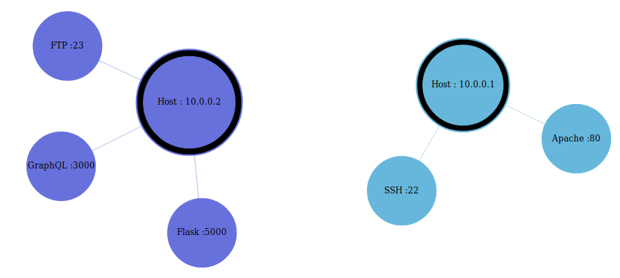

# Network Visualizer

> Work in progress !

:^)

## Summary

1. [Overview](#overview)

2. [Installation](#installation)

## Overview

So I needed something to help me during CTF and stuff to visualize nmap scans. I decided to create one ^.^



This is a dockerized Flask app which uses [amcharts](https://www.amcharts.com/) (a JavaScript library) to render the graph.

## Installation

### Clone the repo

* With SSH :

    ```bash
    git clone git@github.com:OxNinja/Network-Visualizer.git
    ```

* With HTTPS :

    ```bash
    git clone https://github.com/OxNinja/Network-Visualizer.git
    ```

### Build and launch the docker container

Go to the cloned repo : `cd Network-Vizualizer`

```bash
docker build -t network-visualizer . && docker run -d network-vizualizer
```

> Building the container might take a while because I use an Ubuntu 16.04 image as base, which will then update itself and install Flask

You should be able to go to `http://localhost:5000` and see the app.
