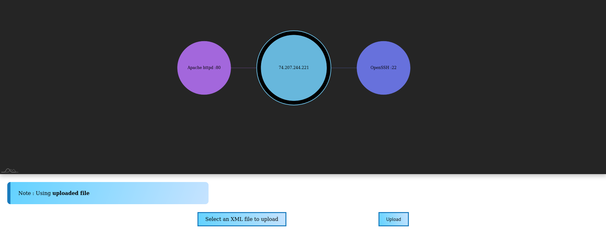

# Network Visualizer

> :warning: Work in progress !

:relaxed:

## Summary

1. [Overview](#overview)

2. [Installation](#installation)

3. [Features](#features)

4. [How to use](#how-to-use)

## Overview

So I needed something to help me during CTF and stuff to visualize nmap scans. I decided to create one ^.^


This is a dockerized Flask app which uses [amcharts](https://www.amcharts.com/) (a JavaScript library) to render the graph.

Here, an example of the application with a custom nmap XML output file :



## Installation

### Clone the repo

* With SSH :

    ```bash
    git clone git@github.com:OxNinja/Network-Visualizer.git
    ```

* With HTTPS :

    ```bash
    git clone https://github.com/OxNinja/Network-Visualizer.git
    ```

### Build and launch the docker container

Go to the cloned repo folder : `cd Network-Visualizer`

```bash
docker-compose up --build
```

You should be able to go to `http://172.16.0.2:5000` and see the app.

## Features

- [x] Render a graph from a JSON file
- [x] File upload on the container
- [ ] Auto load the uploaded file to render
- [x] Parsing XML to JSON

See the [project's kanban](https://github.com/OxNinja/Network-Visualizer/projects/1) for more details.

## How to use

1. Click on `Select an XML file to upload`
2. Select you nmap output file
    `nmap host -oX /path/to/anywhere/file.xml` to create one.
    > If you don't have any, you can browse the repo `/src/app/static/samples` folder and select `nmap.xml`
3. Click `Upload`
4. Profit

